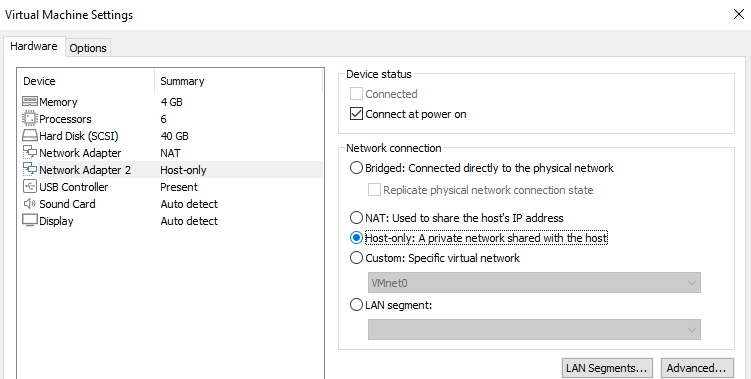
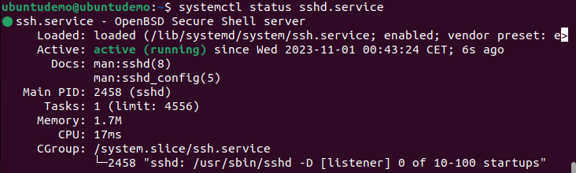

# Linux-on-Windows


Linux on Windows dream setup with VMware. My goal was to have the benefits of Linux distributions like their command line with Windows. It should also include a shared folder so you can share files seamlessly between Windows and Linux. In this guide I will walk you through how you can build your own one-click portal to the world of Linux and close it as easily as you open it.

## Prerequisites
(These versions of the software were used at the time of writing this guide.)
- Windows (Windows 10 19045.3636)
- VMware Workstaion (17.5.0 build-22583795)
- Linux ISO (ubuntu-22.04.3-desktop-amd64.iso)

## Setting up the VMware Virtual Machine
*Hint: You can also use VMware Player after you installed VMware Workstation. We only need some componets of VMware Workstation.*
Once you have clicked on "File->New Virtual Machine..." (Make sure you have updated your RAM and CPU cores to the appropriate levels for your system. For example 25% of your PC's RAM and 75% of your PC's CPU cores. Also give your VM about 50GB of disk space if you can. This space will only be used if needed, so no worries) and boot your Linux image. Next you are going to install your VMware Tools this can sometimes happen automatically, just resize your VMware window and check if the Linux window resizes too, if it does you are good to go.

## Connect to the Virtual Machine via SSH
Right-click on your newly created VM and press "Settings..." and add a second Network Adapter. Check Host-only as Network connection.

We need this adapter to have a static IP address for our SSH connection.

### Installing the SSH server on the Virtual Machine
We can install install the SSH sever with the following command:
```sudo apt install ssh ``` and check its status with ```systemctl status sshd.service```.

If it does not show ```active (running)```, type in the following command ```sudo systemctl enable sshd && sudo systemctl start sshd```.

### Configuring the SSH server
To configure the SSH server we need to edit the ```/etc/ssh/sshd_config``` file. There should be several lines starting with #, remove the # from the following lines and set PasswordAuthentication to no:
```
PermitRootLogin prohibit-password
PubkeyAuthentication yes
PasswordAuthentication no
```
Now we need to generate or copy our SSH public key. If you don't have one, generate one by typing ```ssh-keygen```. Now copy ```<youruser Directory>/.ssh/id_rsa.pub ``` to ```~/.ssh/authorized_keys``` on the Virtual Machine. Restart the SSH server to apply these changes ```sudo systemctl reload ssh```.
### Find out your VM's IP address
Install ifconfig by typing ```sudo apt install net-tools``` and run ```ifconfig```. In most cases, your VM's IP address for your host-only network adapter should start with ```192.168.42.X```. If you find this inet address make a note of it and try to connect to the VM on your Windows PC by typing  ```ssh <username of VM>@<192.168.42.X>```, accept the fingerprint and you should be connect to your VM via SSH.